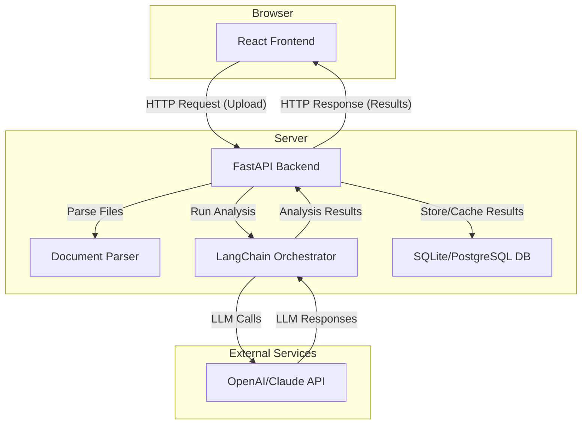

# Technical Architecture: AI CV & Job Application Assistant

## 1. Introduction
This document describes the technical architecture for the "AI CV & Job Application Assistant". The architecture is designed to be modern, scalable, and maintainable, while enabling a fast development cycle for the 1.5-month project timeline.

## 2. Architectural Principles
- **Separation of Concerns**: The frontend (presentation layer) is completely decoupled from the backend (business logic and data layer). This allows for independent development, deployment, and scaling.
- **Stateless Backend**: The backend API will be stateless. All state will be managed by the frontend or stored in the database, which is crucial for horizontal scaling.
- **Component-Based UI**: The frontend will be built using a component-based architecture, promoting reusability and maintainability.

## 3. Technology Stack

### 3.1. Frontend
- **Framework**: **React** (with Vite). React is a mature and popular library for building user interfaces. Vite will provide a fast development server and optimized builds.
- **UI Library**: **Material-UI (MUI)**. To align with the UX design and ensure a polished, professional look, MUI provides a comprehensive set of ready-to-use components (buttons, tabs, etc.).
- **State Management**: **React Context** or **Zustand**. For managing the application's state, such as the uploaded files and analysis results. Zustand is a lightweight and simple alternative to Redux.
- **HTTP Client**: **Axios** or the built-in **Fetch API** for making requests to the backend.

### 3.2. Backend
- **Framework**: **FastAPI** (Python). FastAPI is a modern, high-performance web framework for building APIs with Python. Its automatic data validation and OpenAPI documentation generation will speed up development.
- **Document Parsing**: Python libraries like `PyPDF2` for PDFs and `python-docx` for DOCX files.
- **Asynchronous Processing**: FastAPI's native support for asynchronous operations will be used to handle long-running tasks like document analysis without blocking the server.

### 3.3. AI/LLM Integration
- **Orchestration**: **LangChain**. This library will be used to create and manage the prompts, chains, and agents that interact with the Large Language Model (LLM). It simplifies the process of building complex AI-driven workflows.
- **LLM**: An external API such as **OpenAI's GPT-4** or **Anthropic's Claude**. The choice of model will depend on a balance of cost, performance, and the quality of the generated output.

### 3.4. Database
- **MVP**: **SQLite**. For the initial development and MVP, SQLite is sufficient. It is file-based and requires no separate server setup, making it easy to get started.
- **Production**: **PostgreSQL**. For a production environment, migrating to a more robust database like PostgreSQL is recommended for its scalability and features.

## 4. Architectural Diagram
This diagram illustrates the high-level interaction between the components:



## 5. Data Model
For the MVP, a simple data model is proposed.

**`documents` table**
- `id`: INTEGER (Primary Key)
- `session_id`: TEXT (To group a CV and job posting together)
- `type`: TEXT ('cv' or 'job_posting')
- `filename`: TEXT
- `content`: TEXT (The parsed text from the document)
- `created_at`: DATETIME

**`analysis_results` table**
- `id`: INTEGER (Primary Key)
- `session_id`: TEXT (Foreign Key to documents)
- `cover_letter`: TEXT
- `gap_analysis`: JSON
- `ats_suggestions`: JSON
- `created_at`: DATETIME

*Note: For a full-fledged application with user accounts, a `users` table would be added, and the data would be associated with a `user_id` instead of a `session_id`.*

## 6. Deployment Strategy
- **Frontend**: The React application can be built as a static site and deployed to a service like **Vercel** or **Netlify** for high performance and easy continuous integration.
- **Backend**: The FastAPI backend can be containerized using **Docker** and deployed to a platform-as-a-service (PaaS) like **Render** or **Heroku**.
- **Database**: Managed database services from providers like AWS (RDS) or Render are recommended for production environments.

## 7. Initial Project Setup

To kick off development, the following command can be used to set up the React frontend with Vite:
```bash
npm create vite@latest ai-cv-assistant-ui -- --template react-ts
```
For the backend, a new directory can be created with a `main.py` for the FastAPI application and a `requirements.txt` file listing the dependencies.
