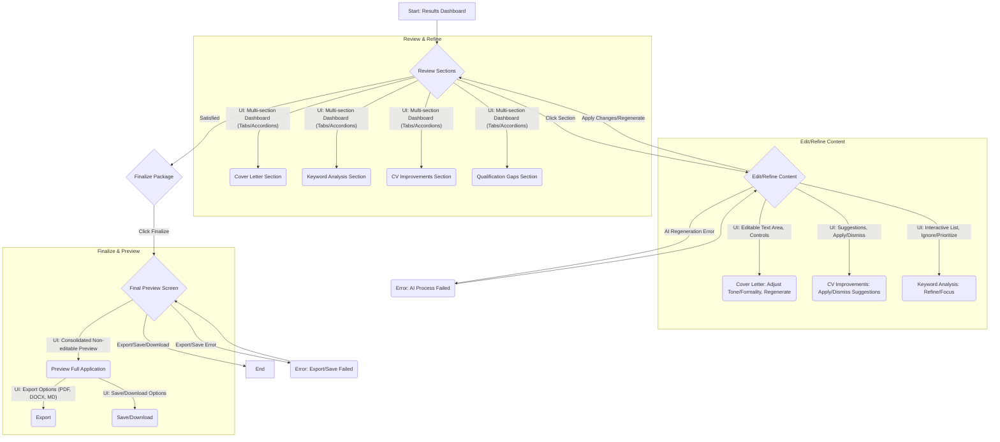

# User Journey: Review and Refine Application Package

**User Goal:** A student wants to understand the AI's suggestions and make final edits to their cover letter and CV.
**Approach:** Single-Screen Approach (with interactive sections)

---

## Flow Steps:

1.  **Entry: Results & Refinement Dashboard**
    *   **Screen:** Results & Refinement Dashboard (same as Step 3 of "Generate" journey)
    *   **User sees:**
        *   Multi-section dashboard with content from the previous step.
        *   Main sections (e.g., Cover Letter, Keyword Analysis, CV Improvements, Qualification Gaps) clearly presented using Material-UI `Tabs`, `Accordion`, or `Card` components.
        *   Prominent "Finalize Package" button.
    *   **User does:** Reviews content, navigates between sections.

2.  **Refine Content within Sections**
    *   **Screen:** Within Results & Refinement Dashboard (interactive sections)
    *   **User sees:**
        *   **Cover Letter Section:** Editable text area, tone/formality adjustments, "Regenerate" button.
        *   **Keyword Analysis Section:** Interactive display of keywords, possibly with options to "ignore" or "prioritize" certain keywords for future AI re-analysis.
        *   **CV Improvements Section:** List of suggestions. For each suggestion, options to "Apply Change" (if AI can auto-rewrite) or "Dismiss".
        *   **Qualification Gaps Section:** List of gaps with suggestions.
    *   **User does:** Edits text directly, uses tone/formality controls, clicks "Regenerate," applies/dismisses suggestions, highlights issues.
    *   **System responds:** Updates content instantly based on user input or AI regeneration. Provides validation checks (e.g., keyword coverage, ATS-friendliness indicators).

3.  **Finalize & Preview**
    *   **Screen:** Final Review Screen (could be a modal or dedicated screen)
    *   **User sees:**
        *   A consolidated, non-editable preview of the entire application package (Cover Letter, Keywords, CV Summary, Gaps).
        *   Prominent "Export" button (PDF, DOCX, Markdown options).
        *   "Save Application" button (if logged in) or "Download All" button.
    *   **User does:** Reviews final package, selects export/save options.
    *   **System responds:** Generates and provides the export/download, confirms save.

---

## Decision Points:

*   **Content Regeneration:** If user regenerates, AI re-processes and updates content.
*   **Suggestion Application:** If user applies a suggestion, AI re-processes affected content.
*   **Finalization:** User must confirm satisfaction before proceeding to export/save.

---

## Error States:

*   **AI Regeneration Error:** Display error, offer retry.
*   **Export/Save Error:** Display error, offer retry or alternative.

---

## Success State:

*   **Completion feedback:** "Application Package finalized and ready for download/export!"
*   **Next action:** User downloads, exports, or saves.

---

## Flow Diagram (Mermaid):

